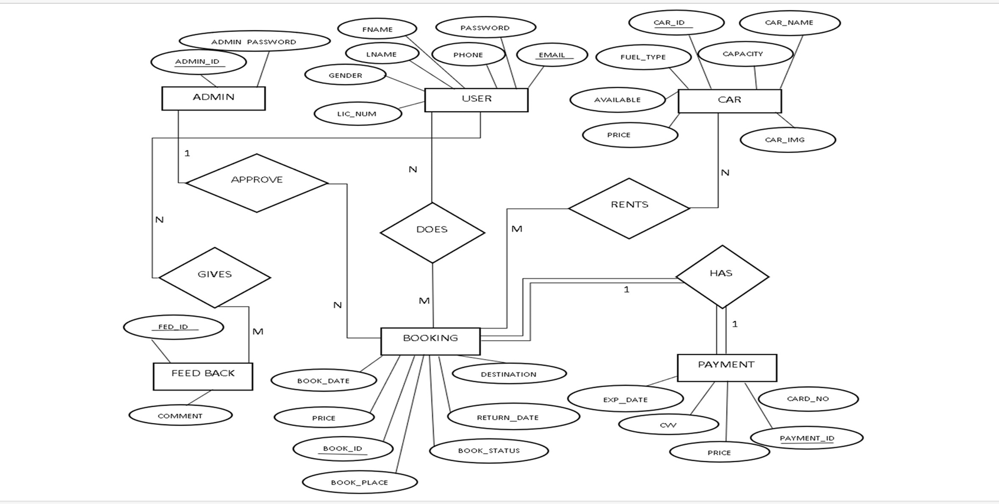

# Car Rental System 🚗

#ER Diagram of Car Rental System  🚘

## 📌 Overview

This project is a **web-based Car Rental System** that allows users to register, login, view available cars, book cars, and make payments. Admins can manage cars, bookings, users, and view feedback from customers.

---

## 🛠️ Built With

- **Frontend:** HTML5, CSS3, JavaScript, Bootstrap  
- **Backend:** PHP  
- **Database:** MySQL  
- **Server:** Apache (via XAMPP)  
- **IDE:** Visual Studio Code  

---

## 🎯 Features

### 🔐 Authentication
- User Registration & Login  
- Admin Login: Admin can login using `ADMIN` as the **username** and **password** then he can assigned another password later

### 🚘 User Features
- View Available Cars  
- Book a Car  
- Make Payment  
- View Booking Status  
- Submit Feedback  

### 🛠️ Admin Features
- Add / Delete Cars  
- View All Bookings  
- Approve Bookings  
- Manage Users  
- Manage Vehicle Information  

---

## 🧪 Testing

All modules (Login, Register, Booking, Payment, Feedback) were tested with successful and failure scenarios.  
Testing included:
- Unit Testing
- Integration Testing
- System Testing  
- Beta Testing

---

